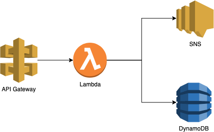

# Sample serverless apps with Go and AWS

[](https://github.com/nb-samples/aws-serverless-go/actions?workflow=build)
[](https://github.com/nb-samples/aws-serverless-go/actions?workflow=deployment)
[](LICENSE)

An example of simple serverless app implementation using Go and AWS, namely Lambda, API Gateway, DynamoDB, and SNS.
Deployment framework utilises GitHub Actions, AWS CloudFormation and Serverless Application Model (SAM).



## Getting started

The solution is almost ready to run but still requires some configuration changes:

- Create IAM configuration (see [IAM configuration](#iam-configuration) section)
- Run SAM configuration (see [SAM configuration](#sam-configuration) section).
  Pay attention to AWS Region question and match it to the one later stored as a secret.
- Commit the results of the last two steps into your repository.
- Create and set following encrypted secrets in your GitHub repository or organization (use the values discovered in the previous steps):
  - AWS_ROLE_TO_ASSUME *(from IAM configuration)*
  - AWS_ACCESS_KEY_ID *(from IAM configuration)*
  - AWS_SECRET_ACCESS_KEY *(from IAM configuration)*
  - AWS_REGION *(from SAM configuration; or replace with hardcoded value in `deploy.yml` workflow)*
  - AWS_SAM_S3_HASH *(the last "hash" part of the S3 bucket name; or commit full bucket name in `samconfig.toml`)*
  - AWS_SAM_S3_BUCKET *(full S3 bucket name; or as above; or commit full bucket name in `samconfig.toml`)*

> **Note:**
> Name of the CloudFormation stack for application deployment must match across IAM and SAM configuration.
> Both use default value `sample-serverless-app` that can be changed if you feel like.
> It's a parameter in `iam-config.yaml` and manual input in SAM guided configuration.

### IAM configuration

CloudFormation stack for IAM configuration creates all necessary artifacts for future application deployment -
*group*, *user*, *role*, *policies*.

```zsh
# Run IAM configuration
$ make iam-config
```

Once the CloudFormation stack deployment is complete,
open AWS console and navigate to *Outputs* tab for stack `sample-iam-config`.
Copy value of the RoleToAssume as you'll need it to create a secret in GitHub.

Now switch to *Resources* tab and click a link to `DeploymentUser`.
Go to *Security credentials* and *Create access key*.
Copy values of the *Access key ID* and *Secret access key* as you'll need it to create secrets in GitHub.

### SAM configuration

**Note:** Make sure to complete build process before running guided configuration.

SAM configuration is environment specific, so you gonna need to *run it at least once*.
When you do, make sure the client is logged in to AWS account and has permissions to create S3 buckets.
You'll need to commit the updated `samconfig.toml` in your repo for automation pipelines to work.

```zsh
# Run SAM configuration
$ make config
```

It is possible to use your own previously created S3 bucket or SAM will do it on your behalf.
Automatically created S3 bucket will show up in your account and have a long name
prefixed with `aws-sam-cli-managed-default-samclisourcebucket-`.
One S3 bucket per region of deployment will be created and re-used in other SAM configurations.

To allow a generic `samconfig.toml` deliver successful deployment outcome,
deployment workflow includes a step to substitute replacement variables in the config.
Supported environment variables are `AWS_REGION`, `AWS_SAM_S3_HASH` and `AWS_SAM_S3_BUCKET`.
Some useful combibnations are:

```toml
# AWS region
region = "{AWS_REGION}"

# Any S3 bucket defined by a full name
s3_bucket = "{AWS_SAM_S3_BUCKET}"

# Default SAM CLI S3 bucket defined by a HASH substring
s3_bucket = "aws-sam-cli-managed-default-samclisourcebucket-{AWS_SAM_S3_HASH}"
```

## Build and test

Examples in this repository use Makefile to execute required actions.
This helps the commands to appear somewhat self-explanatory.

```zsh
# Load dependencies
$ make deps

# Build binaries
$ make build

# Run tests
$ make test

# Run API locally (requires Docker)
$ make local
```

I'm using `sam build` to trigger Golang build process for some convenient behaviour:

1. The outputs build artifacts diverted into folder `.aws-sam/build`.
2. A copy of `template.yaml` with updated `CodeUri` is one of the build artifacts.
3. SAM will discover all components to build based on the deployment template.

## Deployment

Now we're getting close to the fun part -
deployment using AWS Serverless Application Model (**SAM**).
AWS SAM has been around for a while and showed its value for simplified templating.
It is built on top of CloudFormation and basically runs transofrmations producing
the outcome CF template, uploads it to S3, creates change set and deploys.
Overall, it's a quick and easy way to get your head around CloudFormation Stacks.

Deployment process comes in stages - a guided configurator preparing `samconfig.toml`,
loading the components to the cloud, creating and applying the change set.

To deploy application using the earlier saved SAM configuration is a breeze.

```zsh
# Deploy solution to AWS
$ make deploy
```

## Clean up

Clean up action removes the destination directory with compiled binaries
and any other co-located with the code.

```zsh
# Clean up
$ make clean
# Delete AWS resources
$ make delete
```

## CI/CD pipeline

Continuous integration (CI) and continuous deployment (CD) workflows
are implemented using GitHub Actions that follow the same process as documented above.
Deployment workflow has `workflow_dispatch` event trigger, so manual start is expected.
This is intentional behaviour to better comprehend outcomes of the stages.

## Progress

- [x] Sample RESTful API app @ localhost
- [x] Unit tests
- [x] Deployment @ AWS Lambda
  - [x] Manual deployment (exploration)
  - [x] Serverless Application Model (**SAM**) framework
  - [x] CI/CD Pipeline
  - [x] IAM configuration
  - [ ] Amazon Linux 2 :fire:
  - [ ] AWS CDK :question:
- [x] API Gateway
  - [x] REST API Proxy
  - [x] API key
  - [x] Models / JSON Schema
  - [ ] Request validation :hourglass: *(SAM doesn't support it yet)*
- [x] SNS publishing
- [x] DynamoDB persistence
